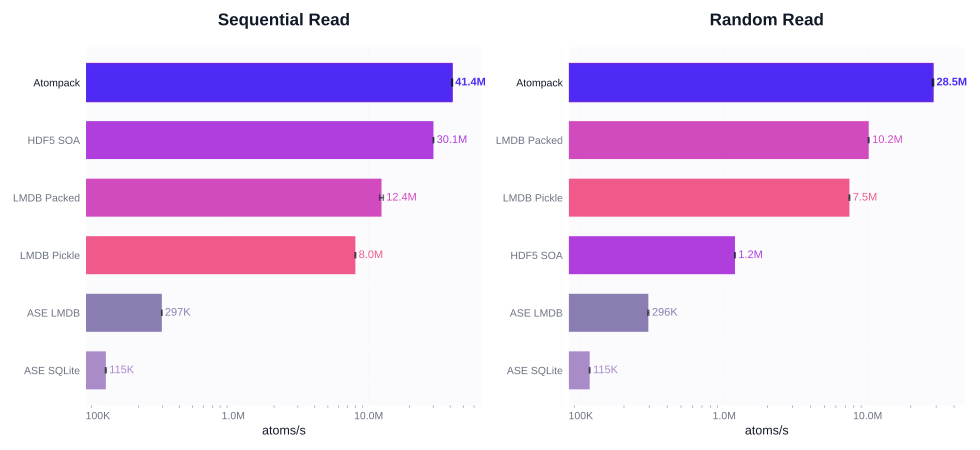

# Atompack

Append-only molecule storage for atomistic ML datasets.

Atompack is a Python package plus Rust core crate for writing, reading, and distributing molecular
structures with forces, energies, charges, stresses, and custom properties. It is designed for
dataset creation, training-time random access, batched loading, and simple distribution as `.atp`
files or shard directories.

<p align="center">
  
</p>

<p align="center">
  <a href="https://YOUR-READTHEDOCS-URL">Documentation</a>
  ·
  <a href="https://huggingface.co/datasets/LeMaterial/Atompack">Hugging Face datasets</a>
</p>

## Installation

```bash
uv pip install "git+https://github.com/Entalpic/atompack.git@main#subdirectory=atompack-py"
```

Hugging Face support ships in the base package.

## Quick Start

```python
import atompack
import numpy as np

positions = np.array([[0.0, 0.0, 0.0], [1.0, 0.0, 0.0]], dtype=np.float32)
atomic_numbers = np.array([6, 8], dtype=np.uint8)

mol = atompack.Molecule.from_arrays(positions, atomic_numbers)
mol.energy = -123.456
mol.forces = np.array([[0.1, 0.2, 0.3], [0.4, 0.5, 0.6]], dtype=np.float32)

db = atompack.Database("data.atp", overwrite=True)
db.add_molecule(mol)
db.flush()

db = atompack.Database.open("data.atp")
print(db[0].energy)

batch = db.get_molecules_flat([0])
print(batch["positions"].shape)
```

`Database.open(path)` is read-only and mmap-backed by default. Reopen with
`Database.open(path, mmap=False)` when you want to append molecules.

## Hugging Face Hub

```python
import atompack

db = atompack.hub.open("LeMaterial/Atompack", "omat/train")
print(len(db))
print(db[0].energy)
db.close()

db = atompack.hub.open("LeMaterial/Atompack", "omol/train")
batch = db.get_molecules([0, 1, 2])
print(len(batch))
db.close()
```

Atompack is commonly used to reopen remote datasets directly from the Hub, especially from
[`LeMaterial/Atompack`](https://huggingface.co/datasets/LeMaterial/Atompack). Typical shard layouts
include `omat/train` and `omol/train`.

If you want a local copy first:

```python
local_path = atompack.hub.download("LeMaterial/Atompack", "omat/train")
db = atompack.hub.open_path(local_path)
```

## Features

- Append-friendly storage with explicit `flush()` commits
- Read-only mmap mode for fast indexed access on static datasets
- Batch-oriented Python APIs for numpy and ASE ingestion
- Builtin support for common atomistic ML fields and custom properties
- Hugging Face Hub helpers for upload, download, and read-only reopening
- Optional compression with `none`, `lz4`, and `zstd`

## Performance

Atompack is optimized for read-heavy atomistic ML workloads: random indexed reads, multiprocessing
data loading, and immutable dataset snapshots. The maintained benchmarks show strong read behavior,
strong batch-write throughput, and storage efficiency that stays close to compact array-oriented
formats.

For the benchmark narrative and current figures, see the
[release blog post](docs/source/blog/atompack-release.md) and
[performance docs](docs/source/performance.rst).

## Documentation

- [Getting started](docs/source/getting-started.rst)
- [Architecture](docs/source/architecture.rst)
- [Hugging Face integration](docs/source/huggingface.rst)
- [Performance notes](docs/source/performance.rst)
- [Contributing](docs/source/contributing.rst)

## Development

This repository uses `uv` for Python tooling:

```bash
# From the repo root
make ci-py
make py-dev
make docs
```

Or run the Python tools directly:

```bash
cd atompack-py
uv sync --extra dev --locked
uv run --extra dev --locked ruff format python
uv run --extra dev --locked ruff check python
uv run --extra dev --locked --with "maturin>=1.4,<2.0" maturin develop
uv run --extra dev --locked pytest
```

Rust entrypoints:

```bash
cargo run -p atompack --example basic_usage
cargo run -p atompack --release --bin atompack-bench -- --help
```

## License

Apache-2.0
