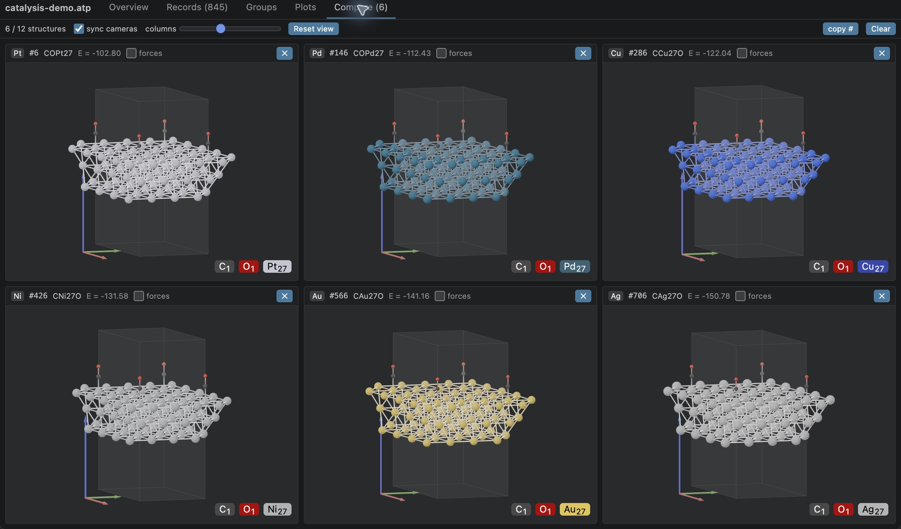
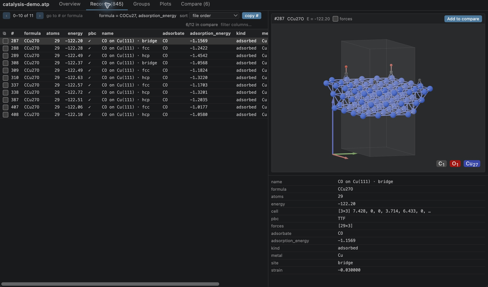
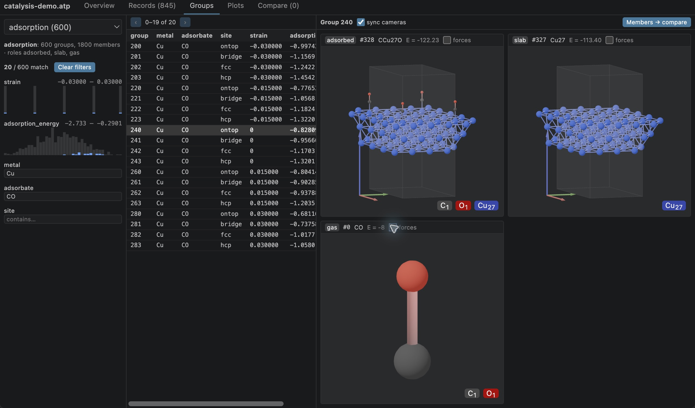
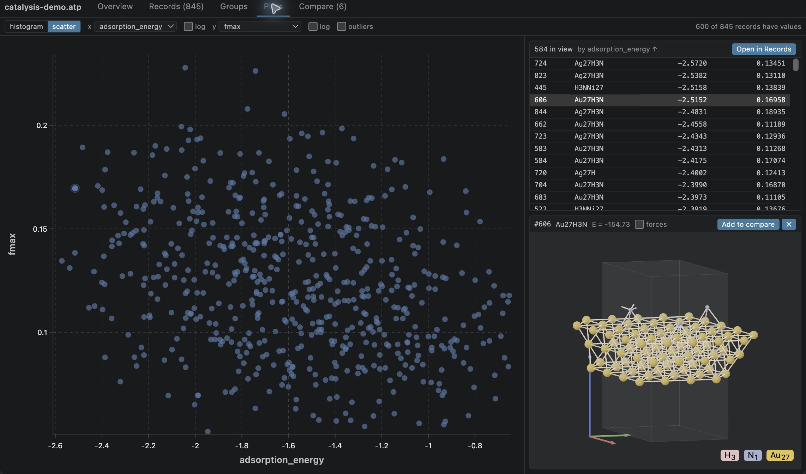

.. Copyright 2026 Entalpic

Explore datasets in VS Code
===========================

The Atompack viewer opens ``.atp`` files inside VS Code. Move from a table of records to
atomic structures, inspect related records as groups, and use plots to select records
for further analysis in Python.

   Compare the members of one metal-series group with synchronized cameras.

Install and open the demo
-------------------------

The extension is currently a preview distributed as platform-specific VSIX packages.
Follow the `installation instructions
<https://github.com/LeMaterial/atompack/blob/main/atompack-vscode/README.md#install>`_
to select a package for your extension host, including remote SSH hosts.

Download :download:`catalysis-demo.atp <_static/data/catalysis-demo.atp>`, open it in VS Code,
and select **Atompack Viewer** with **Reopen Editor With…** if the binary-file notice appears.
The **Overview** tab reports 845 records and four groupings.

.. note::

   This small demonstration dataset uses ASE-built metal surfaces and illustrative
   adsorption geometries. All energies and forces are synthetic; they are not DFT
   results and should not be used for scientific conclusions or model training.

Browse and filter records
-------------------------

Select **Records** to see record numbers, compositions, energies, and custom properties.
Click a row to inspect its structure and metadata. To find CO on copper with an
illustrative adsorption energy below -1, enter::

   formula = COCu27, adsorption_energy < -1

This selects 11 records. **copy #** copies their record numbers in table order as a
Python list, ready for ``db.get_molecules(indices)``.

   Composition and property filters connect the record table to a 3D preview.

Inspect related structures
--------------------------

In **Groups**, choose ``adsorption`` and filter **metal** to ``Cu`` and **adsorbate** to
``CO``. The 20 matching groups each link an ``adsorbed`` structure, its clean ``slab``,
and a ``gas`` reference. Select group 240 for the unstrained, on-top example.

   Role labels preserve the relationship between the three records.

Choose ``metal_series`` and double-click group 0 to open the six-metal comparison
shown above. Other groupings provide 150 ``site_comparison`` groups and 30 ordered
``relaxation`` trajectories of seven frames each.

Find records through plots
--------------------------

In **Plots**, choose **scatter**, set **x** to ``adsorption_energy`` and **y** to ``fmax``.
The 600 adsorption structures have both values. Drag a box to zoom, then click a
record in the list or a point to see its structure. **Open in Records** carries the
visible bounds and sort order into the paginated record table.

   A zoomed region links the property plot, record list, and selected structure.

Keep open datasets immutable
----------------------------

Close the viewer before overwriting or truncating its file: the native reader uses
memory mapping, and changing the backing file can crash the extension host.
The extension README tracks this and the current comparison and camera limitations.

Recreate the dataset
--------------------

The generator is ``examples/vscode_demo.py`` in the repository. With the local Python
package built, run from ``atompack-py``::

   uv run --no-sync --with ase==3.26.0 python ../examples/vscode_demo.py

The generator uses seed ``20260930``, six metals, five adsorbates, four sites, and five
in-plane strains. It writes the downloadable dataset used by these screenshots.
